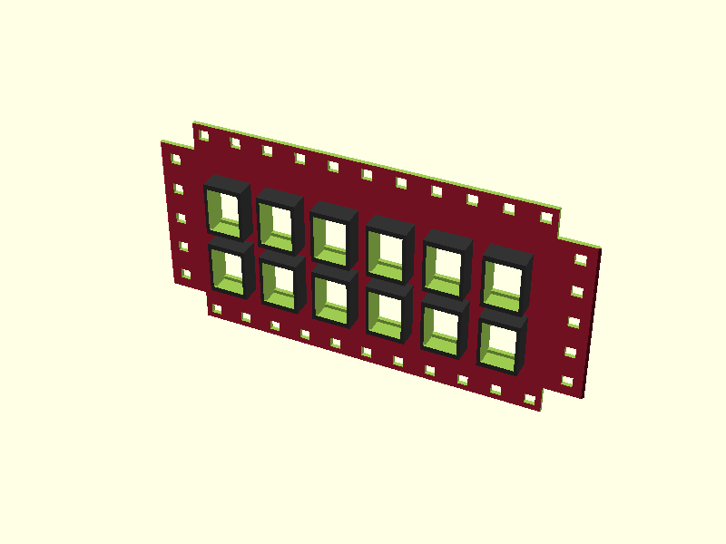
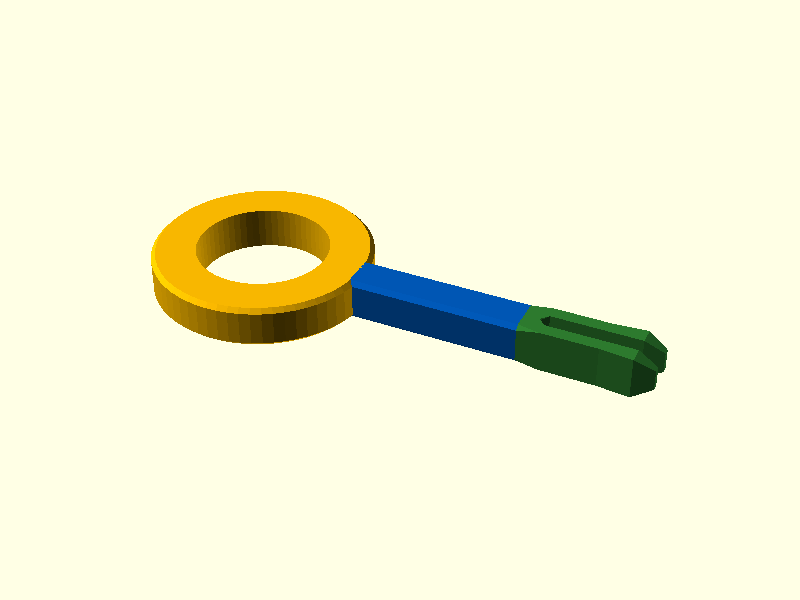
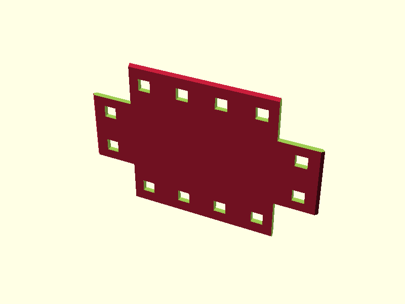
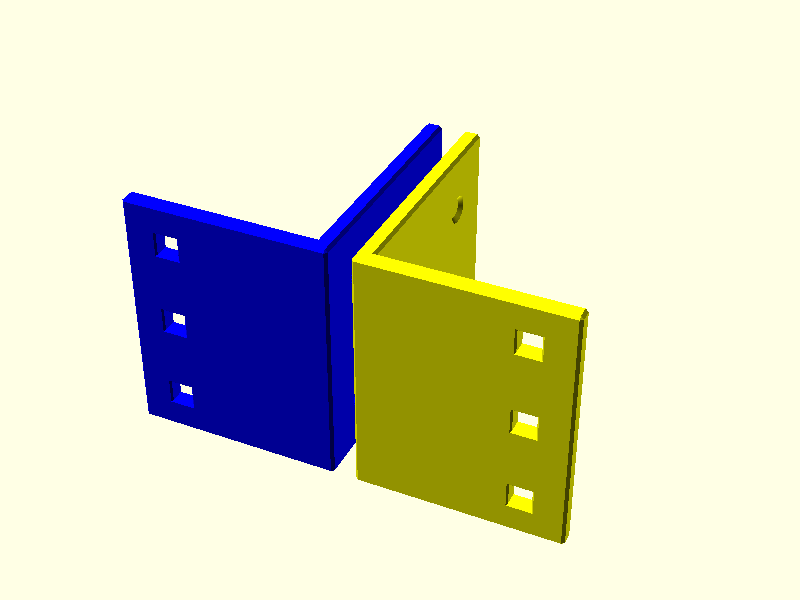

# homeracker-community

The official community repository for sharing creations based on the [HomeRacker](https://github.com/kellerlabs/homeracker) core.

## About

The original [kellerlabs/homeracker](https://github.com/kellerlabs/homeracker) repository is intentionally kept small and focused to remain maintainable for [@kellervater](https://github.com/kellervater). Only fixes to the existing core are accepted there.

**This is the place** for the community to share their own HomeRacker-based creations — custom modules, adapters, accessories, and anything else built on top of the HomeRacker core.

## Configurator

Plan, visualize, and build your HomeRacker setup with the interactive 3D configurator:

### **[Launch HomeRacker Configurator](https://kellerlabs.github.io/homeracker-community/configurator/)**

## Community Models

|                                                                                                                                     |                                                                                                                                                           |
| :---------------------------------------------------------------------------------------------------------------------------------: | :-------------------------------------------------------------------------------------------------------------------------------------------------------: |
|    **[Keystone Patch Panel](models/patch_panel/)** |           **[Temp Locking Pin](models/temp_locking_pin/)**         |
|             **[Blank Panel](models/blank_panel/)**          |    **[Rackmount Ears (homeracker pin edition)](models/rackmount_ears/)** |

## Contributing

See [CONTRIBUTING.md](CONTRIBUTING.md) for setup instructions and contribution guidelines.

## License

Contributions are licensed under MIT (code) and CC BY-SA 4.0 (models).
