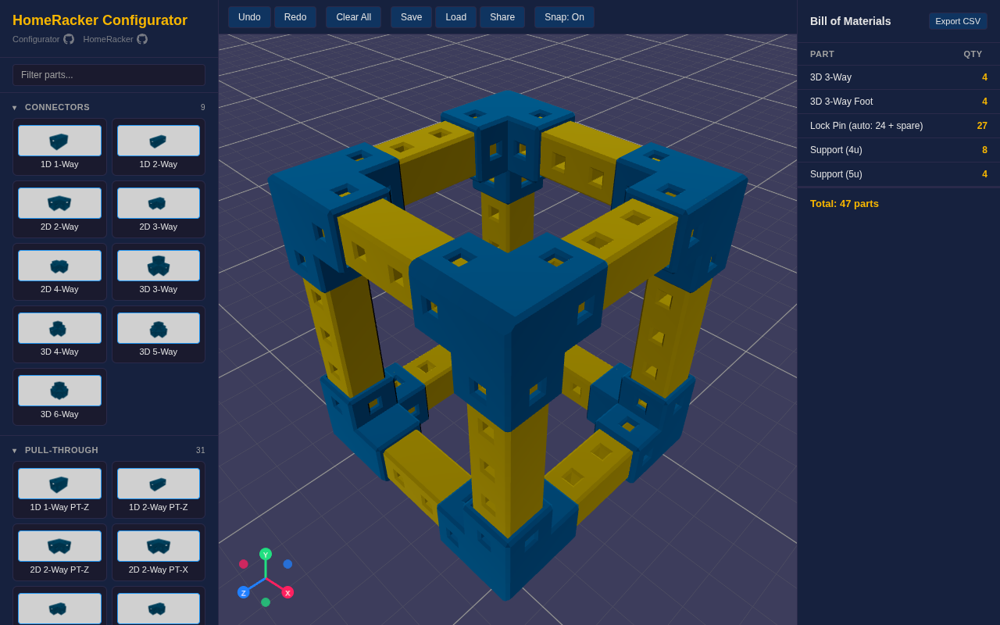

# HomeRacker Configurator

## **[Launch the Configurator](https://zachgoldberg.github.io/homeracker-configurator/)**

A 3D visual planner for [HomeRacker](https://github.com/kellerlabs/homeracker) — the fully modular, 3D-printable rack-building system. Design your rack layout in the browser before printing.



## Features

### Parts Catalog
- **76 built-in parts** — 18 supports (1u–18u), 40+ connectors (1D/2D/3D, regular and foot variants), pull-through connectors, lock pins, and raw model parts
- **Searchable catalog** — filter parts by name in the sidebar
- **Collapsible categories** — organize by Supports, Connectors, Pull-Through, Feet, Lock Pins, Other, and Custom
- **Part thumbnails** — auto-generated 3D previews for every catalog item

### Placement & Snapping
- **Click-to-place** — select a part from the catalog, click the grid to place it
- **Ghost preview** — semi-transparent preview follows cursor, green for valid placement, cyan when snapped
- **Snap-to-connect** — supports snap into connector sockets, connectors snap onto support endpoints (toggle on/off)
- **Orientation-aware snapping** — supports auto-orient to the correct axis when snapping to connectors
- **Auto-rotation** — connectors auto-rotate to align with nearby supports

### Selection & Manipulation
- **Click to select** — click any placed part to select it
- **Multi-select** — Shift+click to add/remove from selection
- **Box select** — Shift+drag to draw a selection rectangle
- **Click-and-drag** — move placed parts with snap assistance
- **Multi-part drag** — drag one selected part to move all selected parts together
- **Nudge with arrow keys** — fine-position selected parts (1 unit per press, Shift for 0.1 unit)
- **Vertical lift** — raise/lower parts with W/S keys
- **Part rotation** — rotate during placement or drag with R/F/T keys

### Colors
- **Per-part colors** — assign custom colors to any part via the color picker
- **12 preset colors** — quick-pick from yellow, blue, red, green, purple, white, black, orange, pink, cyan, lime, gray
- **Custom hex input** — enter any hex color code
- **Reset to default** — revert parts to their category default color

### Copy & Paste
- **Copy selected parts** — Ctrl+C copies selected parts (positions, rotations, colors)
- **Paste with preview** — Ctrl+V enters paste mode with ghost preview, click to place

### Import Custom Models
- **STL import** — load custom STL files as parts in the assembly
- **3MF import** — load 3MF files (ZIP-based 3D manufacturing format) with multi-part support
- **Automatic voxelization** — imported models mapped to grid cells based on actual geometry, not bounding box
- **Persistent storage** — custom parts saved to IndexedDB, survive page reloads
- **Delete custom parts** — remove imported parts from the library

### Bill of Materials
- **Live BOM panel** — part counts update in real-time as you build
- **Lock pin estimates** — auto-calculated with 10% spare
- **Export CSV** — download BOM as a spreadsheet
- **Click to highlight** — click a selected part in the BOM to flash-highlight it in 3D

### Save, Load & Share
- **Save/Load JSON** — download assemblies as `.homeracker.json` files, load them back
- **Auto-save** — assembly auto-saves to localStorage on every change
- **URL sharing** — generate a compressed shareable link with your full assembly embedded in the URL
- **Restore on load** — custom parts and assembly state restored from browser storage

### Undo/Redo
- **Full command history** — every placement, move, delete, and color change is tracked
- **Undo** — Ctrl+Z
- **Redo** — Ctrl+Y or Ctrl+Shift+Z

## Controls

### Placement Mode (after selecting a catalog item)

| Action | Input |
|--------|-------|
| Place part | Click on grid |
| Rotate (Y axis) | `R` |
| Rotate (Z axis) | `F` |
| Rotate (X axis) | `T` |
| Cycle orientation | `O` (supports only) |
| Raise / Lower | `W` / `S` |
| Cancel | `Escape` |

### Selection & Editing

| Action | Input |
|--------|-------|
| Select part | Click |
| Multi-select | `Shift` + Click |
| Box select | `Shift` + Drag on empty space |
| Move part | Click and drag |
| Nudge (1 unit) | Arrow keys |
| Fine nudge (0.1 unit) | `Shift` + Arrow keys |
| Raise / Lower | `W` / `S` |
| Delete selected | `Delete` / `Backspace` |
| Copy | `Ctrl+C` |
| Paste | `Ctrl+V` |

### General

| Action | Input |
|--------|-------|
| Undo | `Ctrl+Z` |
| Redo | `Ctrl+Y` / `Ctrl+Shift+Z` |
| Orbit camera | Left-click drag (on empty space) |
| Zoom | Scroll wheel |

## Quick Start

```bash
bun install
bun run dev
```

Open http://localhost:5173 in your browser.

## Tech Stack

- [React 19](https://react.dev/) + [TypeScript 5](https://www.typescriptlang.org/)
- [Three.js 0.172](https://threejs.org/) via [@react-three/fiber v9](https://r3f.docs.pmnd.rs/) and [@react-three/drei v10](https://drei.docs.pmnd.rs/)
- [Bun](https://bun.sh/) for bundling, dev server, and runtime
- [Playwright](https://playwright.dev/) for e2e tests
- [OpenSCAD](https://openscad.org/) + [trimesh](https://trimesh.org/) for generating GLB models from parametric sources
- Deployed to [GitHub Pages](https://zachgoldberg.github.io/homeracker-configurator/) via GitHub Actions
- Zero external runtime dependencies beyond React and Three.js — no UI framework, no state library, no build tool chain

## Scripts

```bash
bun run dev              # Start dev server
bun run build            # Production build to dist/
bun run generate-models  # Regenerate GLB models from OpenSCAD (parallel)
bun run test:e2e         # Run headless e2e tests
bun run test:e2e:headed  # Run e2e tests with visible browser
```

## Project Structure

```
src/
  assembly/       # Grid logic, snap engine, assembly state, undo/redo
  components/     # React components (App, ViewportCanvas, BOM, Sidebar, etc.)
  data/           # Part catalog, connector configs, custom parts (STL/3MF)
  export/         # Save/load functionality
  sharing/        # URL-based sharing with compression
  thumbnails/     # Part thumbnail generation
  constants.ts    # Base unit, colors, grid settings
  types.ts        # Shared TypeScript types
scripts/          # Build, dev server, e2e tests, model generation
public/models/    # GLB part models
e2e/              # End-to-end tests (Playwright)
```

## License

See the [HomeRacker project](https://github.com/kellerlabs/homeracker) for licensing details.
